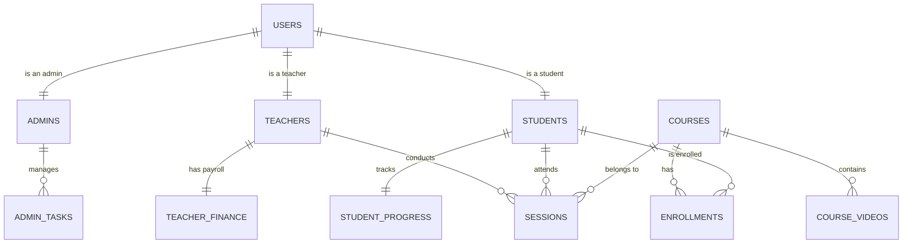

# Mashael-Almarefa Database Schema

This document outlines the relational database structure for the Mashael-Almarefa platform, designed for professional deployment with a real database (PostgreSQL/Supabase).

## ER Diagram (Conceptual)

## Tables Definition

### 1. `users` (Core Auth Table)
The main table for authentication and user management.
| Column | Type | Description |
| :--- | :--- | :--- |
| `id` | UUID (PK) | Unique identifier |
| `email` | VARCHAR(255) | Unique login email (Login Identity) |
| `password_hash` | VARCHAR(255) | Encrypted credentials |
| `role` | ENUM | 'admin', 'teacher', 'student' |
| `full_name` | VARCHAR(255) | Global display name |
| `is_verified` | BOOLEAN | Email verification status |
| `created_at` | TIMESTAMP | Registration date |
| `last_login` | TIMESTAMP | Last session activity |

### 2. `admins` (Administrator Profile)
Stores specific data for platform administrators.
| Column | Type | Description |
| :--- | :--- | :--- |
| `user_id` | UUID (FK) | Reference to `users.id` |
| `admin_level` | VARCHAR(50) | 'super_admin', 'editor', 'moderator' |
| `permissions` | JSONB | Specific access rights |

### 3. `students` (Student Profile)
Extended profile for students.
| Column | Type | Description |
| :--- | :--- | :--- |
| `user_id` | UUID (FK) | Reference to `users.id` |
| `student_code` | VARCHAR(20) | Unique student ID (e.g., STD-001) |
| `age` | INT | Age of the student |
| `country` | VARCHAR(100) | Residency |
| `guardian_name` | VARCHAR(255) | Parent's name (for children) |
| `guardian_phone`| VARCHAR(20) | Contact for guardian |
| `current_level` | VARCHAR(100) | Progress level (e.g., Level 1) |
| `department` | VARCHAR(100) | Department (Quran/Arabic/Curricula) |

### 4. `teachers` (Teacher Profile)
Extended profile for teachers, visible to students.
| Column | Type | Description |
| :--- | :--- | :--- |
| `user_id` | UUID (FK) | Reference to `users.id` |
| `specialization`| TEXT | Professional field |
| `bio` | TEXT | Description for profile card |
| `phone` | VARCHAR(20) | Contact number (WhatsApp) |
| `photo_url` | TEXT | Link to profile image |
| `availability` | TEXT | Working hours description |
| `status` | ENUM | 'active' (نشط), 'on_vacation' (إجازة) |
| `rating` | DECIMAL(3,2) | User satisfaction score |

### 5. `courses` (Course Catalog)
The repository of all educational tracks available.
| Column | Type | Description |
| :--- | :--- | :--- |
| `id` | SERIAL (PK) | Course identifier |
| `title` | VARCHAR(255) | Name of the course |
| `description` | TEXT | Summary and objective |
| `category` | VARCHAR(100) | (Quran, Tajweed, Arabic, etc.) |

### 6. `course_videos` (Courses Center Data)
Dynamic list of uploaded materials in the Admin Courses Center.
| Column | Type | Description |
| :--- | :--- | :--- |
| `id` | SERIAL (PK) | Video identifier |
| `course_id` | INT (FK) | Reference to `courses.id` |
| `video_url` | TEXT | Cloud storage link |
| `thumbnail_url` | TEXT | Preview image link |
| `notes` | TEXT | Video description/notes |
| `upload_date` | DATE | Date of addition |

### 7. `sessions` (Educational Classes)
Tracks lesson scheduling and historic data.
| Column | Type | Description |
| :--- | :--- | :--- |
| `id` | SERIAL (PK) | Unique ID |
| `teacher_id` | UUID (FK) | Reference to `teachers.user_id` |
| `student_id` | UUID (FK) | Reference to `students.user_id` |
| `course_id` | INT (FK) | Reference to `courses.id` |
| `session_date` | DATE | Date of the session |
| `session_time` | TIME | Start time |
| `duration` | INT | Minutes (15, 30, 45, 60, etc.) |
| `meet_link` | TEXT | Meeting room link |
| `status` | ENUM | 'scheduled', 'completed', 'canceled' |
| `topic` | TEXT | Subject discussed in the lesson |

### 8. `student_progress` (Academic Statistics)
Dynamic tracking for student dashboards.
| Column | Type | Description |
| :--- | :--- | :--- |
| `student_id` | UUID (FK) | Reference to `students.user_id` |
| `attendance_pct`| INT | Overall attendance percentage |
| `skills_reading`| INT | Skill score 0-100 |
| `skills_writing`| INT | Skill score 0-100 |
| `skills_listen` | INT | Skill score 0-100 |
| `skills_convo` | INT | Skill score 0-100 |
| `total_hours` | INT | Accumulated learning hours |
| `achievements` | TEXT | Milestone history |

### 9. `finances` (Teacher Payroll)
Financial tracking as seen in `/admin/teacher-sessions`.
| Column | Type | Description |
| :--- | :--- | :--- |
| `teacher_id` | UUID (FK) | Reference to `teachers.user_id` |
| `rate_per_session`| DECIMAL(10,2) | Agreed rate per session |
| `total_due` | DECIMAL(10,2) | Auto-sum of completed sessions |
| `amount_paid` | DECIMAL(10,2) | Manual entry of received funds |
| `balance` | DECIMAL(10,2) | Remaining amount to be paid |

### 10. `admin_tasks` (Checklist)
The manual task system in `/admin/dashboard`.
| Column | Type | Description |
| :--- | :--- | :--- |
| `id` | SERIAL (PK) | Task identifier |
| `admin_id` | UUID (FK) | Reference to `users.id` |
| `content` | TEXT | Task description |
| `is_completed` | BOOLEAN | Status of the task |
| `created_at` | TIMESTAMP | Creation date |
