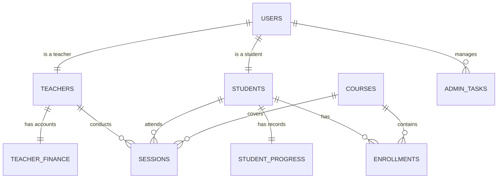

# Mashael-Almarefa Database Schema

This document outlines the relational database structure for the Mashael-Almarefa platform, designed to replace the current `localStorage` based dynamic data management.

## ER Diagram (Conceptual)

## Tables Definition

### 1. `users`
Core authentication and identification table.
| Column | Type | Description |
| :--- | :--- | :--- |
| `id` | UUID (PK) | Unique identifier |
| `full_name` | VARCHAR(255) | User's display name |
| `email` | VARCHAR(255) (Unique) | Login email |
| `password_hash` | VARCHAR(255) | Encrypted password |
| `role` | ENUM | 'admin', 'teacher', 'student' |
| `created_at` | TIMESTAMP | Registration date |
| `last_login` | TIMESTAMP | Last access time |

### 2. `students`
Extended profile for students.
| Column | Type | Description |
| :--- | :--- | :--- |
| `user_id` | UUID (FK) | Reference to `users.id` |
| `student_code` | VARCHAR(20) | e.g., 'STD-24017' |
| `age` | INT | Student's age |
| `country` | VARCHAR(100) | Resident country |
| `guardian_name` | VARCHAR(255) | Name of parent/guardian |
| `guardian_phone`| VARCHAR(20) | Contact phone |
| `current_level` | VARCHAR(100) | Academic level |
| `department` | VARCHAR(100) | e.g., 'Arabic', 'Quran' |

### 3. `teachers`
Extended profile for teachers.
| Column | Type | Description |
| :--- | :--- | :--- |
| `user_id` | UUID (FK) | Reference to `users.id` |
| `specialization`| TEXT | e.g., 'Specialist in Tajweed' |
| `bio` | TEXT | Professional biography |
| `phone` | VARCHAR(20) | WhatsApp/Contact number |
| `photo_url` | TEXT | Profile image path/URL |
| `availability` | TEXT | e.g., 'Sat, Mon 5-9 PM' |
| `status` | ENUM | 'active' (نشط), 'on_vacation' (إجازة) |
| `rating` | DECIMAL(3,2) | Overall rating from 1 to 5 |

### 4. `courses`
List of available educational tracks.
| Column | Type | Description |
| :--- | :--- | :--- |
| `id` | SERIAL (PK) | Unique identifier |
| `title` | VARCHAR(255) | Course name |
| `description` | TEXT | Course summary |
| `created_by` | UUID (FK) | Admin who created it |

### 5. `sessions` (Lessons/Classes)
The heart of the scheduling and attendance system.
| Column | Type | Description |
| :--- | :--- | :--- |
| `id` | SERIAL (PK) | Unique identifier |
| `teacher_id` | UUID (FK) | Reference to `teachers.user_id` |
| `student_id` | UUID (FK) | Reference to `students.user_id` |
| `course_id` | INT (FK) | Reference to `courses.id` |
| `session_date` | DATE | Date of the class |
| `session_time` | TIME | Start time |
| `duration` | INT | Duration in minutes |
| `meet_link` | TEXT | Google Meet or similar URL |
| `status` | ENUM | 'scheduled', 'completed', 'canceled' |
| `topic_covered` | TEXT | What was taught (if completed) |
| `teacher_notes` | TEXT | Private notes from teacher |

### 6. `student_progress`
Tracks skills and achievements for students.
| Column | Type | Description |
| :--- | :--- | :--- |
| `student_id` | UUID (FK) | Reference to `students.user_id` |
| `reading_pct` | INT | Reading skill 0-100 |
| `writing_pct` | INT | Writing skill 0-100 |
| `listening_pct`| INT | Listening skill 0-100 |
| `convo_pct` | INT | Conversation skill 0-100 |
| `achievements` | TEXT | List of milestone reached |
| `average_rating`| DECIMAL(3,1) | Average rating from lessons |
| `total_hours` | INT | Total hours completed |

### 7. `finances` (Accounting)
Manages teacher rates and payments.
| Column | Type | Description |
| :--- | :--- | :--- |
| `teacher_id` | UUID (FK) | Reference to `teachers.user_id` |
| `rate_per_session`| DECIMAL(10,2) | Negotiated rate per lesson |
| `total_earned` | DECIMAL(10,2) | Auto-calculated (sessions * rate) |
| `amount_paid` | DECIMAL(10,2) | Total received by teacher |
| `last_payment_at`| TIMESTAMP | Date of last payout |

### 8. `admin_tasks`
Operational checklist for admins.
| Column | Type | Description |
| :--- | :--- | :--- |
| `id` | SERIAL (PK) | Task ID |
| `description` | TEXT | Task content |
| `status` | ENUM | 'pending', 'completed' |
| `created_at` | TIMESTAMP | Task creation date |
